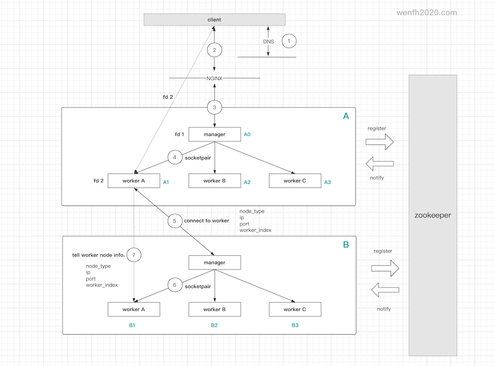

# co_kimserver

> <font color=red>【注意】</font> 项目尚未完成，请谨慎使用！

---

## 1. 简述

`co_kimserver` 是高性能的 TCP 网络通信框架。

* 多进程框架（manager/workers）。
* 基于腾讯开源的轻量级协程库 [libco](https://github.com/Tencent/libco)。
* 主要使用 C/C++11 语言开发。
* 支持 tcp 协议。
* 使用 protobuf 封装通信协议。
* 通过 zookeeper 管理服务节点，实现分布式微服务布局。

---

## 2. 架构

[分布式系统-多进程框架节点通信](https://wenfh2020.com/2020/10/23/kimserver-node-contact/)

<div align=center></div>

---

## 3. 运行环境

项目支持 Linux 平台。

>【注意】Libco 不支持与 jemalloc 同时使用，jemalloc 容易出现死锁。

源码编译前需要先安装依赖的第三方库：

* mysqlclient
* protobuf
* hiredis
* cryptopp
* zookeeper_mt ([安装 zookeeper-client-c](https://wenfh2020.com/2020/10/17/zookeeper-c-client/))

---

## 4. 编译

到 co_kimserver 根目录，执行编译脚本。

```shell
 ./run.sh compile all
```

---

## 5. 运行

编译成功后，进入 bin 目录运行启动服务。

```shell
cd bin
./co_kimserver config.json
```

---

## 6. 测试

[压测源码](https://github.com/wenfh2020/co_kimserver/tree/main/src/test/test_tcp_pressure)。

单进程（libco 共享栈）服务本地压力测试：

400 个用户，每个用户发 10,000 个包，并发：184,838 / s。

```shell
# ./test_tcp_pressure 127.0.0.1 3355 400 10000
spend time: 21.6406
avg:        184838
send cnt:         4000000
callback cnt:     4000000
ok callback cnt:  4000000
err callback cnt: 0
```

---

## 7. 服务配置

```shell
./bin/config.json
```

```shell
{
    "server_name": "kim-gate",              # 服务器名称。
    "worker_cnt": 1,                        # 子进程个数，因为服务是多进程框架，类似 nginx。
    "node_type": "gate",                    # 节点类型（gate/logic/...）。微服务，用户可以根据需要，自定义节点类型。
    "node_host": "127.0.0.1",               # 服务集群内部节点通信 host。
    "node_port": 3344,                      # 服务集群内部节点通信 端口。
    "gate_host": "127.0.0.1",               # 服务对外开放 host。（对外部客户端或者第三方服务。不对外服务可以删除该选项。）
    "gate_port": 3355,                      # 服务对外开放端口。（不对外服务可以删除该选项。）
    "gate_codec": "protobuf",               # 服务对外协议类型。目前暂时支持协议类型：protobuf。
    "keep_alive": 30,                       # 服务对外连接保活有效时间。
    "log_path": "kimserver.log",            # 日志文件。
    "log_level": "info",                    # 日志等级。(trace/debug/notice/warning/err/crit)
    "modules": [                            # 业务功能插件，动态库数组。
        "module_test.so"
    ],
    "redis": {                              # redis 连接池配置，支持配置多个。
        "test": {                           # redis 配置节点，支持配置多个。
            "host": "127.0.0.1",            # redis 连接 host。
            "port": 6379                    # redis 连接 port。
        }
    },
    "database": {                           # mysql 数据库连接池配置。
        "test": {                           # mysql 数据库配置节点，支持配置多个。
            "host": "127.0.0.1",            # mysql host。
            "port": 3306,                   # mysql port。
            "user": "root",                 # mysql 用户名。
            "password": "root123!@#",       # mysql 密码。
            "charset": "utf8mb4",           # mysql 字符集。
            "max_conn_cnt": 5               # mysql 连接池最大连接数。
        }
    },
    "zookeeper": {                          # zookeeper 中心节点管理配置。用于节点发现，节点负载等功能。
        "servers": "127.0.0.1:2181",        # redis 服务连接信息。
        "log_path": "zk.log",               # zookeeper-client-c 日志。
        "nodes": {                          # 节点发现配置。
            "root": "/kimserver/nodes",     # 节点发现根目录，保存了各个节点信息，每个节点启动需要往这个目录注册节点信息。
            "subscribe_node_type": [        # 当前节点关注的其它节点类型数组。用于集群里，节点之间相互通信。填充信息可以根据上面 node_type 配置。
                "gate",                     # 接入节点类型。
                "logic"                     # 逻辑节点类型。
            ]
        },
        "payload": {                        # zookeeper 节点负载信息。节点会定时刷新（1次/s），同步当前节点负载。
            "root": "/kimserver/payload"    # 节点发现根目录。
        }
    }
}
```
