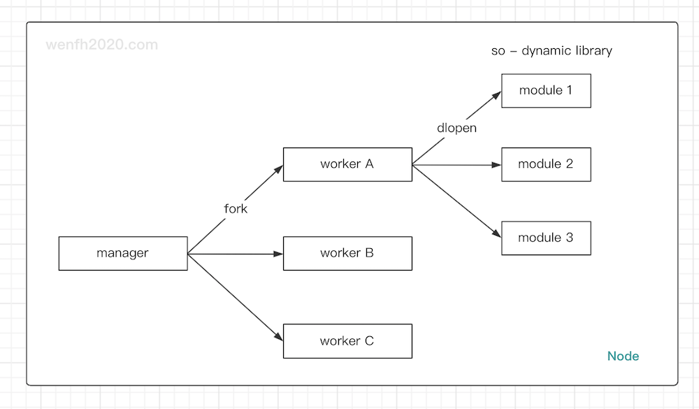

# co_kimserver

> <font color=red>【注意】</font> 项目尚未完成，请谨慎使用！

---

## 1. 简述

`co_kimserver` 是高性能 TCP 网络通信框架。

* 多进程工作模式（manager/workers）。
* 基于腾讯开源的轻量级协程库 [libco](https://github.com/Tencent/libco)。
* 主要使用 C/C++11 语言开发。
* 支持 tcp 协议。
* 使用 protobuf 封装通信协议。
* 支持访问 mysql, redis (client: hiredis)。
* 通过 zookeeper 管理服务节点，支持分布式微服务部署。

---

## 2. 运行环境

项目支持 Linux 平台。源码依赖第三方库：

* mysqlclient
* protobuf3
* hiredis
* crypto++
* zookeeper_mt ([安装 zookeeper-client-c](https://wenfh2020.com/2020/10/17/zookeeper-c-client/))

>【注意】libco 不兼容 jemalloc，jemalloc 容易出现死锁。

---

## 3. 架构

单节点多进程工作模式，支持多节点分布式部署。

---

### 3.1. 单节点

* manager 父进程：负责子进程管理调度，外部连接初始接入。
* worker 子进程：负责客户端详细连接逻辑。
* module 动态库：业务源码实现。(参考：[co_kimserver/src/modules/](https://github.com/wenfh2020/co_kimserver/tree/main/src/modules))

<div align=center></div>

---

### 3.2. 多节点

服务节点通过 `zookeeper` 发现其它节点。（下图是客户端与服务端多节点建立通信流程。）

<div align=center></div>

---

## 4. 编译

* 方法一

```shell
# 执行脚本生成 protobuf 源码。
cd ./co_kimserver/src/core/protobuf
chmod +x gen_proto.sh
./gen_proto.sh

# 编译整个源码文件。
cd ./co_kimserver/src
make clean; make
```

---

* 方法二

```shell
cd ./co_kimserver
chmod +x run.sh
./run.sh compile all
```

---

## 5. 运行

源码编译成功后，进入 bin 目录启动服务。

* 方法一

```shell
cd ./co_kimserver/bin
./co_kimserver config.json
```

---

* 方法二

```shell
cd ./co_kimserver
./run.sh
```

---

## 6. 测试

单进程服务，本地压力测试 100w 条数据（10000 个用户，每个用户发 100 个包）。

* 压测命令（[压测源码](https://github.com/wenfh2020/co_kimserver/tree/main/src/test/test_tcp_pressure)）。

```shell
./test_tcp_pressure [host] [port] [protocol(1001/1003/1005)] [users] [user_packets]
```

* 测试数据。

| 测试功能                | 数据量 | 并发                |
| :---------------------- | :----- | :------------------ |
| 普通协议（hello world） | 100w   | 119,479 / s         |
| 读写 mysql              | 100w   | 5133 * 2 = 10,266/s |
| 读写 redis              | 100w   | 9655 * 2 = 19,310/s |

---

## 7. 服务配置

```shell
./bin/config.json
```

```shell
{
    "server_name": "kim-gate",              # 服务器名称。
    "worker_cnt": 1,                        # 子进程个数。（服务是多进程工作模式，类似 nginx。）
    "node_type": "gate",                    # 节点类型（gate/logic/...）。用户可以根据需要，自定义节点类型。
    "node_host": "127.0.0.1",               # 服务集群内部节点通信 host。
    "node_port": 3344,                      # 服务集群内部节点通信 端口。
    "gate_host": "127.0.0.1",               # 服务对外开放 host。（对外部客户端或者第三方服务。不对外服务可以删除该选项。）
    "gate_port": 3355,                      # 服务对外开放端口。（不对外服务可以删除该选项。）
    "gate_codec": "protobuf",               # 服务对外协议类型。目前暂时支持协议类型：protobuf。
    "keep_alive": 30,                       # 服务对外连接保活有效时间。
    "log_path": "kimserver.log",            # 日志文件。
    "log_level": "info",                    # 日志等级。(trace/debug/warn/info/notice/error/alert/crit)
    "max_clients": 512,                     # 最大支持用户数量（与系统支持的进程最大文件数量有关）。
    "modules": [                            # 业务功能插件，动态库数组。
        "module_test.so"
    ],
    "redis": {                              # redis 连接池配置，支持配置多个。
        "test": {                           # redis 配置节点，支持配置多个。
            "host": "127.0.0.1",            # redis 连接 host。
            "port": 6379,                   # redis 连接 port。
            "max_conn_cnt": 5               # redis 连接池最大连接数。
        }
    },
    "database": {                           # mysql 数据库连接池配置。
        "test": {                           # mysql 数据库配置节点，支持配置多个。
            "host": "127.0.0.1",            # mysql host。
            "port": 3306,                   # mysql port。
            "user": "root",                 # mysql 用户名。
            "password": "root123!@#",       # mysql 密码。
            "charset": "utf8mb4",           # mysql 字符集。
            "max_conn_cnt": 5               # mysql 连接池最大连接数。
        }
    },
    "zookeeper": {                          # zookeeper 中心节点管理配置，用于节点发现，节点负载等功能。
        "servers": "127.0.0.1:2181",        # zookeeper 服务配置。
        "log_path": "zk.log",               # zookeeper-client-c 日志。
        "log_level": "debug",               # zookeeper-client-c 日志等级。(debug/warn/info/error)
        "root": "/kimserver",               # 节点发现根目录，保存了各个节点信息，每个节点启动需要往这个目录注册节点信息。
        "watch_node_type": [                # 当前节点关注其它节点类型（"node_type"），用于节点相互通信。
            "gate",                         # 接入节点类型。（用户可在配置自定义 "node_type"）
            "logic"                         # 逻辑节点类型。（用户可在配置自定义 "node_type"）
        ]
    }
}
```
